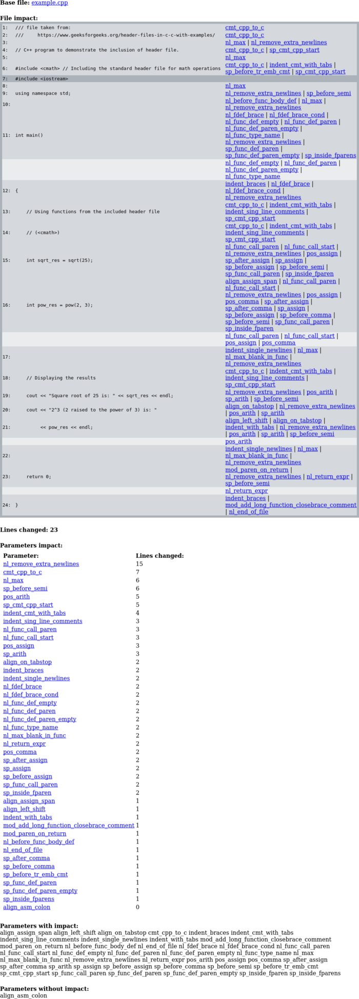
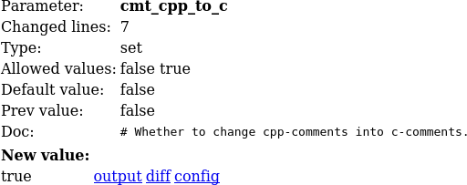

# uncrustify-impact

Display uncrustify configuration impact on given source files.

Uncrustify has a lot of configuration parameters. Some parameters are dedicated to different languages (e.g. for Java or C#).
Moreover documentation of the parameters can be misleading and impact on source code can be unclear.

There come the tool. It works simply by taking source code file and uncrustify config file. For configuration file 
application changes values one by one for every parameter. Then the result differences are merged into one diff, so 
it is clear what happens when parameter changes.

Application generates various files:
- main page with summary
- parameter page with with description and impact
- diff file for each parameter
- config file for each change


Example of main page with summary is presented below. Rows with dark gray background present no changes, rows with gray color 
show modifications (lines changed or removed) and light gray rows show added lines. Column on right contains names of parameters  
that introduced the change. Bellow the difference view there is sorted table with parameter names and number of caused 
changes in source file.

[](examples/uncrustify_impact_simple/impact/index.png)


Example of parameter page with some information.

[](examples/uncrustify_impact_simple/impact/cmt_cpp_to_c.png)


## Running application

Execute following command `python3 -m uncrustimpact --help` to receive [cmd help](doc/cmdargs.md).

Simple command run example:

```
python3 -m uncrustimpact impact --file {path-to-C++-file} \
                                --config {path-to-uncrustify-config} \
                                --outputdir {output-directory}
```

More examples and use cases can be found in `examples` directory.


## Installation

Installation of package can be done by:
 - to install package from downloaded ZIP file execute: `pip3 install --user -I file:uncrustify-impact-master.zip#subdirectory=src`
 - to install package directly from GitHub execute: `pip3 install --user -I git+https://github.com/anetczuk/uncrustify-impact.git#subdirectory=src`
 - uninstall: `pip3 uninstall uncrustimpact`

Installation For development:
 - `install-deps.sh` to install package dependencies only (`requirements.txt`)
 - `install-package.sh` to install package in standard way through `pip` (with dependencies)
 - `install-package-dev.sh` to install package in developer mode using `pip` (with dependencies)


## Development

All tests and content generators can be executed by simple script `./process-all.sh`.

Unit tests are executed by `./src/testuncrustimpact/runtests.py`.

Code linters can be run by `./tools/checkall.sh`.


## References

- [uncrustify](https://github.com/uncrustify/uncrustify)


## License

BSD 3-Clause License

Copyright (c) 2024, Arkadiusz Netczuk <dev.arnet@gmail.com>

Redistribution and use in source and binary forms, with or without
modification, are permitted provided that the following conditions are met:

1. Redistributions of source code must retain the above copyright notice, this
   list of conditions and the following disclaimer.

2. Redistributions in binary form must reproduce the above copyright notice,
   this list of conditions and the following disclaimer in the documentation
   and/or other materials provided with the distribution.

3. Neither the name of the copyright holder nor the names of its
   contributors may be used to endorse or promote products derived from
   this software without specific prior written permission.

THIS SOFTWARE IS PROVIDED BY THE COPYRIGHT HOLDERS AND CONTRIBUTORS "AS IS"
AND ANY EXPRESS OR IMPLIED WARRANTIES, INCLUDING, BUT NOT LIMITED TO, THE
IMPLIED WARRANTIES OF MERCHANTABILITY AND FITNESS FOR A PARTICULAR PURPOSE ARE
DISCLAIMED. IN NO EVENT SHALL THE COPYRIGHT HOLDER OR CONTRIBUTORS BE LIABLE
FOR ANY DIRECT, INDIRECT, INCIDENTAL, SPECIAL, EXEMPLARY, OR CONSEQUENTIAL
DAMAGES (INCLUDING, BUT NOT LIMITED TO, PROCUREMENT OF SUBSTITUTE GOODS OR
SERVICES; LOSS OF USE, DATA, OR PROFITS; OR BUSINESS INTERRUPTION) HOWEVER
CAUSED AND ON ANY THEORY OF LIABILITY, WHETHER IN CONTRACT, STRICT LIABILITY,
OR TORT (INCLUDING NEGLIGENCE OR OTHERWISE) ARISING IN ANY WAY OUT OF THE USE
OF THIS SOFTWARE, EVEN IF ADVISED OF THE POSSIBILITY OF SUCH DAMAGE.
